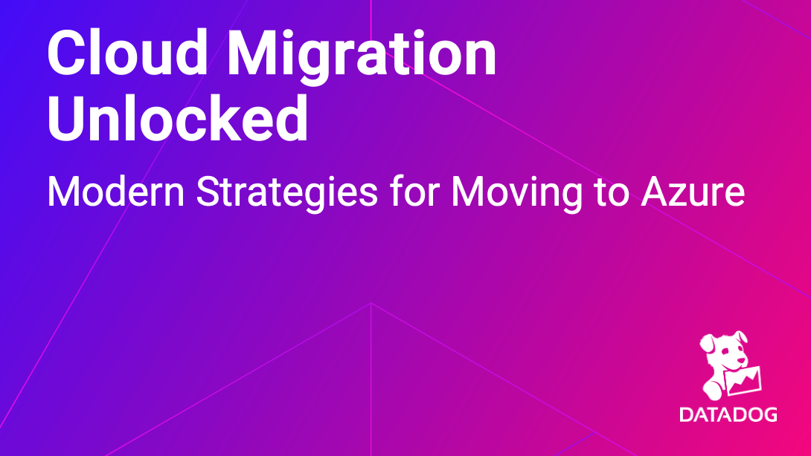

# Cloud Migration Unlocked: Modern Strategies for Moving to Azure

This README contains all of the resources shared during the Datadog webinar titled "Cloud Migration Unlocked: Modern Strategies for Moving to Azure".

### Slides

[Slides in PDF](https://github.com/jasonhand/azure_cloud_migration_strategies/blob/main/slides/Cloud%20Migration%20Unlocked-PDF.pdf)

### Try Datadog
- [Datadog Free Trial](https://dtdg.co/4ctJOiC)

### State Of Reports
- [Datadog State of Serverless](https://dtdg.co/4cqbrcG)
- [Datadog State of Security](https://dtdg.co/3Mr7JoF)
- [Datadog State of Cloud Costs](https://dtdg.co/4dm4ZVn)

### Blogs
- [Avoid Azure migration cost overruns with Datadog Cloud Cost Management](https://dtdg.co/3yFInQs)
- [Successfully migrate to Azure with the Microsoft Cloud Adoption Framework and Datadog](https://dtdg.co/4fOm4cb)
- [Strategize your Azure migration for SQL workloads with Datadog](https://dtdg.co/3Al7Qiu)
  
### Datadog Docs
- [Datadog Guide: Azure Cloud Adoption Framework](https://dtdg.co/4dIhbPX)
- [Datadog <> Azure Integration](https://dtdg.co/3YGhMNR)

### Azure Migration Ebook
- [Azure Migration Ebook](https://dtdg.co/4dGFduC)

### Microsoft Azure Resources
- [Azure Migrate](https://azure.microsoft.com/en-us/products/azure-migrate)
- [Azure Migrate Services Overview](https://learn.microsoft.com/en-us/azure/migrate/migrate-services-overview)
- [Cloud Adoption Framework](https://learn.microsoft.com/en-us/azure/cloud-adoption-framework/get-started/#cloud-adoption-scenarios)

### Gartner

[Public Cloud Spend Predictions](https://www.gartner.com/en/newsroom/press-releases/2024-05-20-gartner-forecasts-worldwide-public-cloud-end-user-spending-to-surpass-675-billion-in-2024)

### AAG
[Cloud Computing Trends in 2023](https://aag-it.com/the-latest-cloud-computing-statistics/)

